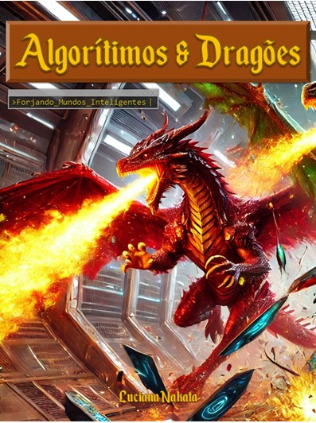

create-ebook-with-chatgpt
> Academic Project for Open Education Platform DIO 

ALGORÍTIMOS E DRAGÕES: FORJANDO MUNDOS INTELIGENTES -LUCIANA NAKATA

# Projeto: Criando um E-Book com ChatGPT & Midjourney para o Bootcamp de Tecnologia CAIXA - IA Generativa com Microsoft Copilot

 > 🗒️ **SOBRE:** Este é o repositório desenvolvido durante o Bootcamp promovido pela plataforma da [DIO](https://dio.me) em parceria com a Caixa Econômica Federal e a Microsoft. Projeto com o objetivo de explorar e aprimorar o uso das plataformas de Inteligência Artificial disponíveis através do desenvolvimento de um e-book. 

<a href="https://github.com/lsnakata/create-podcast-with-ia/blob/main/CINE_IA-EP.01.MP3" title="View PDF Now"> ⏯️ Podcast disponível para download aqui</a>

## 🖋️ Ferramentas Utilizadas no Projeto

- [ChatGPT](https://chat.openai.com/) 
- [DALL-E](https://openai.com/index/dall-e/)
- [PowerPoint](https://www.microsoft.com/en/microsoft-365/powerpoint)

## 🖥️ Desenvolvimento 

A escolha do tema foi realizada de acordo com a preferência do aluno/autor que deveria já possuir conhecimento prévio sobre o assunto selecionado conforme instruído em aula. 
Foram solicitadas ao ChatGPt opções de títulos e subtítulos para o e-book, assim como sugestões de conteúdo textual do mesmo. 
Também no ChatGPT foi feito um aprofundamento nos tópicos dos capítulos que posteriormente foram revisados e reescritos quando necessário, bem como o título e o subtítulo do livro. 
Em seguida a imagem da capa foi gerada no DALL-E e todo o conteúdo obtido foi reunido no Microsoft PowerPoint para edição e aprimoramento pelo aluno/autor.
Segue abaixo os Prompts de cada etapa. 

## 🗨️ Prompts

ChatGPT：

|      Objetivo     | Prompt                                                                                                                                                                                                                                                                                                              |
|     :------:      | ------------------------------------------------------------------------------------------------------------------------------------------------------------------------------------------------------------------------------------------------------------------------------------------------------------------- |
| Opções de Títulos  | Crie um título para um e-book sobre o tema de inteligência artificial aplicada em jogos de rpg {REGRAS} >O nicho é jogos de rpg >O subnicho é inteligência atificial >O título deve ser épico e curto >O título tem que ter um estilo mais geek >Me dê 5 opções                                           |
| Conteúdo de Texto  | Escreva um e-book sobre o tema de inteligência artificial aplicada em jogos de rpg {REGRAS} >O nicho é jogos de rpg >O subnicho é inteligência atificial >Explique de maneira simples >Deixe o texto enxuto >Crie títulos e subtítulos sugestivos para cada tópico >Cite exemplos                          |
| Aprimorar Conteúdo | Reescreva o conteúdo dos capítulos em forma de dissertação                                                                           |
|  Aprofundar Tema   | Me conte quais ferramentas de IA existem para jogos de RPG de mesa {REGRAS} >Cite exemplos                                           |

DALL-E：

|     Objetivo     | Prompt                                                                                 |
|      :----:      | -------------------------------------------------------------------------------------- |
|  Imagem de Capa  | I want a picture of three medieval dragons of different colors in a digital dungeon like the inside of a spaceship {RULES} >I want it to look like they are invading the spaceship >I want them to look different from each other                                   |

Obs: Não foi possível utilizar o Midjourney para a geração das imagens, por isso selecionei o DALL-E para substituí-lo.

## ✨ Features

- Conteúdo de texto gerado com o auxílio do ChatGPT
- Imagens geradas via DALL-E
- Produto final estruturado em Microsoft PowerPoint
  

## 📚 Materiais

- Imagens utilizadas disponíveis em `inventory`

## 👨‍💻 Autoria

Luciana Nakata
 
 <a href="www.linkedin.com/in/luciana-nakata-43397b86">LinkedIn</a> 

&nbsp;
